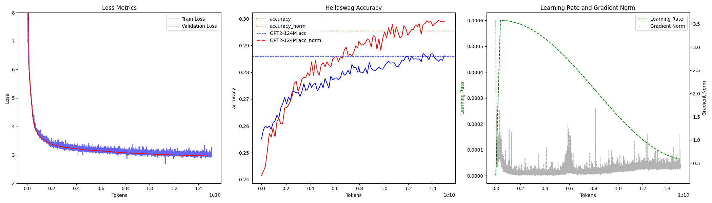

# GPT2

In this project we repoduce the GPT architecture implementation and re-train it to match OpenAI 2019 results. 
This project is for us a PoC of a distributed pretraining experiment.

The dataset originally chosen for pretraining is a 10B subset of the SlimPajama dataset. First results were disappointing so we switched to the FineWeb-Edu dataset (15B tokens) (highly qualitative data). The training is performed on 2xA100 80GB. We effectively reach (and beat) GPT2 (small) performance.

This project is inspired from: https://github.com/karpathy/build-nanogpt/tree/master
